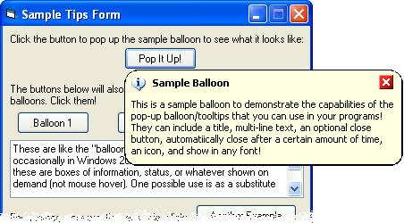



## Popup Balloons \(2k/XP\-style\)

### Description

This code will show Windows 2000/XP-style popup balloons. They were introduced in Windows 2000, and in XP they're seen all over, especially in the system tray. But Microsoft hasn't released how to use them yet (except for tray icons),and--if they did--it would only work on Windows 2000 or later.

This project shows you how you can use these balloons in your programs. Instead of relying on Windows to make them, this program makes its own. Therefore, it will not only work with Windows 2000 and XP, but also with all other versions of Windows (down to 95). It's not a wrapper for the common controls or extension of them; it's completely done by itself. They're kind of like tooltips, but they're shown on demand--not mouse hover (although I suppose you could modify it to make it do that, if you wanted to).

They're also highly customizable. You can set, of course, the bold title at the top and the text to be shown. You can also set it to automatically close after a certain period of time, specify whether or not to show an "X" close button, specify an icon to appear on the balloon (similar to the message box's; you can use "i", "X", or "!") or none at all, change the font that it's displayed in, and more! And of course you can change it however you want, since the source is included.

One possible use for this, if you're not familiar with thes balloons, is to use it like a message box to display a small error or other information that you need to tell the user but don't really need to bother them with a message box for. Included in my sample project is a division program that will display a balloon with a "Divsion by Zero" error if you attempt to do so (e.g., 4÷0). Also included in the demo is a project that the screenshot here was taken from.

Looking at the screenshot is the best way to see what this code does. I hope you enjoy it. Remember, if you like it, please vote and/or leave comments! Thanks! :)

PS - This is the second "release" of this project, and I am aware of some issues, most of which are documented in my code's comments. For example, making the the balloon drastically smaller or drastically larger than what it defaults to may affect the border's appearance. I'm working to fix these.
 
### More Info
 

             |
---                |---
**Submitted On**   |2002-02-09 21:27:20
**By**             |[Robert Morris](https://github.com/Planet-Source-Code/PSCIndex/blob/master/ByAuthor/robert-morris.md)
**Level**          |Intermediate
**User Rating**    |4.5 (177 globes from 39 users)
**Compatibility**  |VB 5\.0, VB 6\.0
**Category**       |[VB function enhancement](https://github.com/Planet-Source-Code/PSCIndex/blob/master/ByCategory/vb-function-enhancement__1-25.md)
**World**          |[Visual Basic](https://github.com/Planet-Source-Code/PSCIndex/blob/master/ByWorld/visual-basic.md)
**Archive File**   |[Popup\_Ball54296292002\.zip](https://github.com/Planet-Source-Code/robert-morris-popup-balloons-2k-xp-style__1-31434/archive/master.zip)

